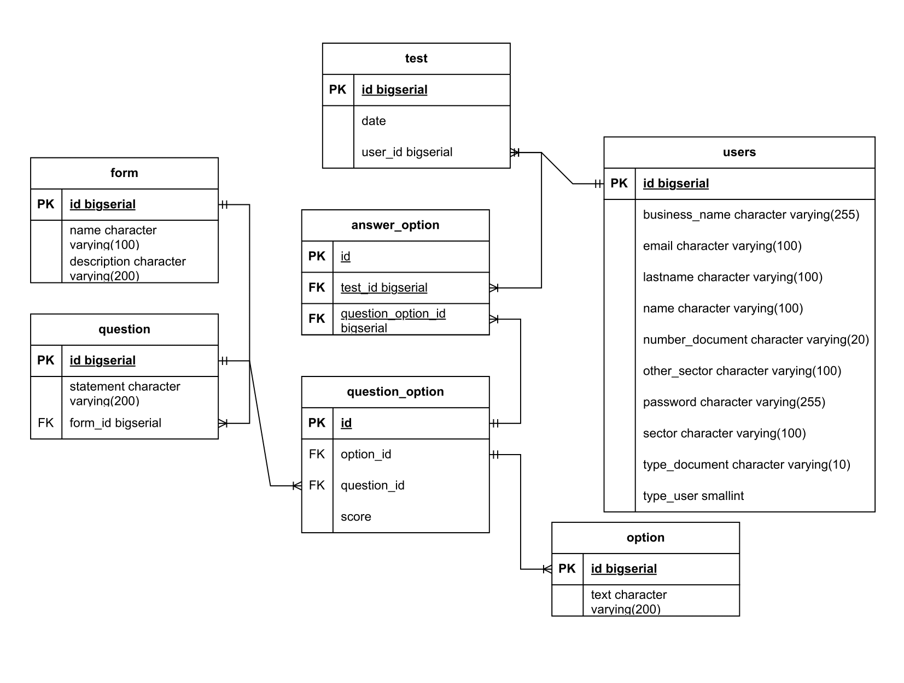
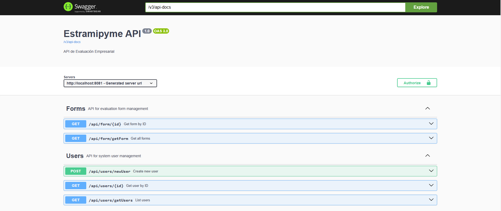

# **Estramipyme**

## **Índice**

1. [Descripción](#descripción)
2. [Tecnologías](#tecnologías)
3. [Requisitos Previos](#requisitos-previos)
4. [Configuración del Proyecto](#configuración-del-proyecto)
5. [API Documentation](#api-documentation)
6. [Contribuciones](#contribuciones)

---

## **Descripción**

> Este proyecto es un backend desarrollado en Java que proporciona funcionalidades de autenticación y gestión de
formularios. Incluye un sistema de login y registro de usuarios, permite gestionar formularios y genera
reportes personalizados en formato PDF. Está construido utilizando Spring Boot, con seguridad implementada mediante
Spring Security. Además, se utiliza Swagger para documentar la API, asegurando una interfaz clara y accesible para los
desarrolladores.

---

## **Tecnologías**

- **Lenguaje:** Java 17
- **Framework:** Spring Boot 3
- **Base de Datos:** PostgreSQL
- **Herramientas adicionales:** Lombok, Swagger.

---

## **Requisitos Previos**

- **Java JDK**: versión 17 o superior
- **Maven**: versión 3.8+
- **Base de datos**: PostgreSQL 14 o compatible

---

## **Configuración del Proyecto**

Guía paso a paso para clonar, configurar y preparar el proyecto.

### **Clonar el repositorio**

Ejecuta los siguientes comandos en tu terminal:

```sh
git clone https://github.com/leydimadrid/project-estramipyme-backend.git
cd project-estramipyme-backend
```

### **Configurar las variables de entorno**

Actualiza los valores en el archivo application.properties o utiliza un archivo .env para las credenciales de la base de
datos.

```sh
spring.datasource.url=jdbc:postgresql://localhost:5432/nombre_base_datos
spring.datasource.username=usuario
spring.datasource.password=contraseña
```

### **Creación base de datos**

**Diagrama entidad-relación**


Después de configurar el archivo application.properties, ejecuta el proyecto de Spring Boot. Si todo está correctamente configurado, las tablas se crearán automáticamente en la base de datos. Luego, proceda a llenar las tablas utilizando el siguiente script.

En el siguiente enlace encontrarás el script SQL: https://drive.google.com/drive/folders/1LxrT0Y0ZVret1kMz8WPP9COWGnA0cVk_?usp=drive_link

### **Instalar dependencias**

```sh
mvn clean install
```

# **API Documentation**

---

-Url documentación en local: http://localhost:8081/swagger-ui/index.html

-Url documentación en la nube: https://project-estramipyme-backend-production-44d9.up.railway.app/swagger-ui/index.html

## **Introducción**

La API está diseñada para gestionar usuarios, formularios y reportes. Utiliza autenticación basada en tokens (JWT) y
cuenta con documentación interactiva generada con Swagger.




## **Contribuciones**

Si deseas contribuir al proyecto, sigue estos pasos:

1. Haz un fork del repositorio.
2. Crea una nueva rama para tus cambios:

```sh
git checkout -b nombre-rama
```

3. Realiza los cambios necesarios en el código y haz un commit:

```sh
git commit -m "Descripción del cambio"
```

4. Haz un push de los cambios a tu rama:

```sh
git push origin nombre-rama
```

5. Crea un Pull Request desde tu rama hacia el repositorio original.

**¡Gracias por contribuir! Todas las propuestas serán revisadas antes de su integración.**


